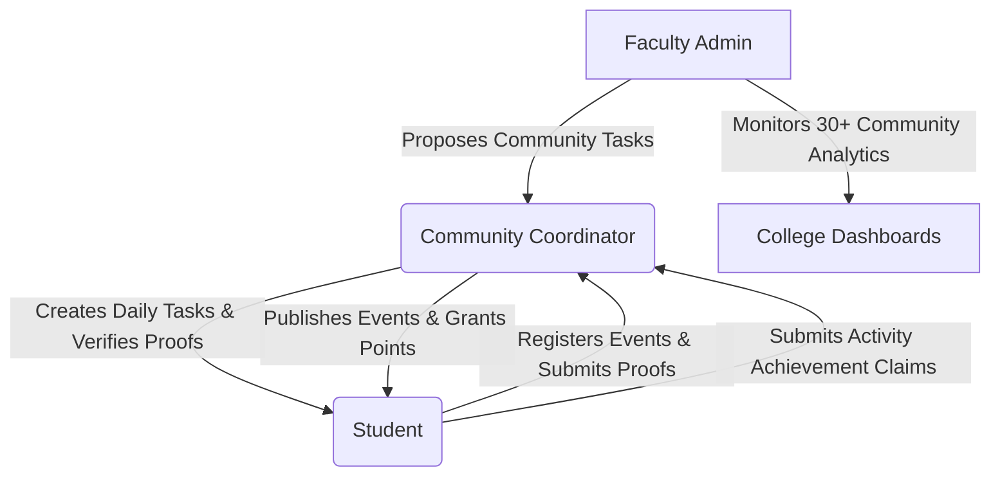

# 🏛️ SCTS - Smart Campus Extracurricular & Community Tracking System

> **A Next-Generation Campus Extracurricular Platform with Gamified Leaderboards, Event Scope Enforcement, Task Governance, and Real-Time Participation Analytics.**

---

## 🌟 System Overview

**SCTS (Smart Campus Extracurricular & Community Tracking System)** is an end-to-end web application engineered for universities and colleges to streamline extracurricular activities, student community memberships, event management, and task deliverables across 30+ campus communities.

The platform incentivizes student participation through a **Gamification Point System**, enables **Faculty Task Governance**, provides **Community Coordinators with Live Analytics**, and empowers students to build verified **Academic & Extracurricular Portfolios**.

---

## 📐 Entity-Relationship (ER) Diagram


---

## 🛠️ Technology Stack

| Layer | Technologies Used |
| :--- | :--- |
| **Frontend Core** | React 18, Vite, React Router v6, TailwindCSS |
| **Data Visualization & Icons** | Recharts (Responsive Pie & Bar Charts), Lucide React Icons |
| **Backend Core** | Java 21, Spring Boot 3.2.3, Spring Data JPA, Spring Security |
| **Database** | In-Memory H2 Database (`jdbc:h2:mem:sctsdb`), Hibernate ORM |
| **Authentication** | JWT (JSON Web Tokens) with Stateless Security Filter Chain |
| **Reports & Export** | HTML5 Print API / CSS Paged Media PDF Engine |

---

## 👥 User Roles & Access Control Matrix



### 1️⃣ 🎓 **Student Role**
- **Dashboard & Portfolio**: View academic details, overall attendance percentage, verified volunteer hours, and total gamification points.
- **My Joined Communities**: Browse and request membership for 30+ campus communities.
- **Task Deliverables (`/student/tasks`)**: Submit task proofs (URL link or file) for **Faculty Community Tasks (+5 Pts)** and **Coordinator Daily Tasks (+3 Pts)**.
- **Events & Registration (`/student/events`)**:
  - Participate in 🌐 **Global Campus Events** (Open to all students, **+1 Pt**).
  - Participate in 🔒 **Community Events** (Strictly private to approved community members).
- **Activity Requests (`/student/activity-requests`)**: Submit individual achievement claims (external hackathon wins, research papers, certifications) to community coordinators for custom point evaluations.
- **Activity Timeline (`/student/timeline`)**: Track registered events and verified task submissions chronologically.
- **Leaderboards (`/student/leaderboard`)**: View real-time rank positions across individual communities and campus-wide.

### 2️⃣ 🛡️ **Community Coordinator Role**
- **Coordinator Dashboard (`/coordinator/dashboard`)**:
  - Review live **Community Participation Analytics** (*Task Verifications Breakdown, Active Member Participation Rate, Task Category Distribution*).
  - Approve or decline pending student membership requests.
- **Task Assignments (`/coordinator/tasks`)**:
  - Accept Faculty Community Tasks proposed by Faculty.
  - Create **Daily Tasks** for community members.
  - Verify student task proof submissions (+3 Pts or +5 Pts awarded).
  - Finalize and submit completed Community Task packages to Admin.
- **Event Management (`/coordinator/events`)**: Create & publish 🔒 **Community Events** or 🌐 **Global Events**, and inspect registered student rosters.
- **Activity Requests Review (`/coordinator/activity-requests`)**: Review student achievement claims, assign custom gamification points (+5, +10, +15, +20 Pts), and provide feedback notes.
- **Community Reports (`/coordinator/reports`)**: Export official community activity summaries.

### 3️⃣ 🏆 **Faculty Admin Role**
- **College Dashboard (`/faculty/dashboard`)**: Track overall campus participation metrics, total registrations, and top active communities.
- **Task Oversight (`/faculty/dashboard`)**: Propose campus-wide Community Tasks across all 30+ communities.
- **Participation Analytics (`/faculty/analytics`)**: Select any of the 30+ campus communities to inspect real-time Recharts data graphs for task deliverables, proof verifications, and active member rates.
- **Coordinator & Student Search (`/faculty/coordinator-search`, `/faculty/student-search`)**: Audit student portfolios and search coordinator contact details.

---

## 🎯 Gamification & Point Evaluation Rules

| Activity Type | Point Weight | Verification & Rules |
| :--- | :--- | :--- |
| 🎟️ **Event Registration** | **+1 Point** | Awarded automatically upon registering for any valid event. |
| 📅 **Coordinator Daily Task** | **+3 Points** | Created by Coordinator ➔ Verified by Coordinator upon proof submission. |
| 🏛️ **Faculty Community Task** | **+5 Points** | Proposed by Faculty ➔ Accepted by Coordinator ➔ Verified by Coordinator (+5 Pts) ➔ Submitted to Admin. |
| 🏆 **Activity Achievement Claim** | **Custom Points (+5 to +50 Pts)** | Submitted by student for external hackathons/certifications ➔ Custom points evaluated and granted by Coordinator. |

---

## ⚡ Key Feature Highlights

- **Dynamic Recharts Data Visualizations**: Custom Tooltip contrast styling, `<Legend />` positioning, and empty-state fallbacks to eliminate `NaN` / `0/0` SVG chart errors.
- **Real-Time Notification System**: Unread badge count and instant mark-all-as-read API.
- **PDF Portfolio Generation**: Printable official student transcripts and community reports.

---

## 🚀 Quickstart & Setup Guide

### 1. Prerequisites
- **Java Development Kit (JDK 21 or higher)**
- **Node.js (v18.0.0 or higher) & npm**
- **Apache Maven (Wrapper included)**

---

### 2. Running the Backend Server (Spring Boot)

Navigating to the backend project directory:
```bash
cd scts/backend
```

Build and test-compile the application:
```bash
./mvnw clean test-compile
```

Run the Spring Boot application (Server runs on `http://localhost:8080`):
```bash
./mvnw spring-boot:run
```

*Note: H2 Database console is available at `http://localhost:8080/h2-console` (JDBC URL: `jdbc:h2:mem:sctsdb`, Username: `SA`, Password: `[blank]`).*

---

### 3. Running the Frontend Dev Server (Vite + React)

Navigate to the frontend project directory:
```bash
cd scts/frontend
```

Install NPM dependencies:
```bash
npm install
```

Start the Vite development server (Runs on `http://localhost:5173`):
```bash
npm run dev
```

---

## 🔑 Default Seed Credentials for Testing

The system automatically initializes seed data upon startup with the following test credentials:

| Role | Username / Email | Password | Access Scope |
| :--- | :--- | :--- | :--- |
| **Student** | `student@scts.edu` | `password` | Joined Communities, Tasks, Events, Activity Claims, Leaderboard |
| **Coordinator** | `coordinator@scts.edu` | `password` | Coding Club Coordinator Dashboard, Deliverable Verification, Event Creation |
| **Faculty** | `faculty@scts.edu` | `password` | College Dashboard, Task Governance, 30+ Communities Participation Analytics |

---

## 📄 License & System Status

Designed & Developed for **Smart Campus Extracurricular Tracking Systems (SCTS)**.
All features audited and verified for production compatibility.
