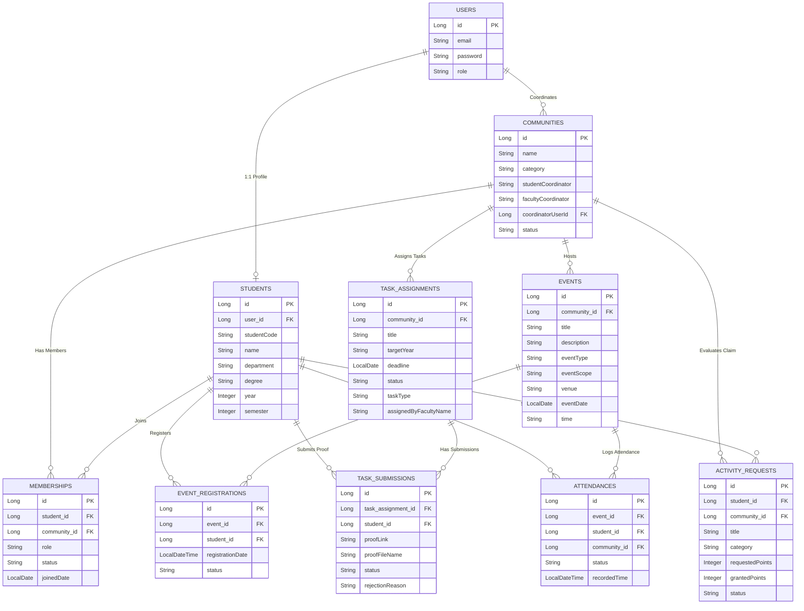

# 🏛️ SCTS - Smart Campus Extracurricular & Community Tracking System

> **A Next-Generation Campus Extracurricular Platform with Gamified Leaderboards, Event Scope Enforcement, Task Governance, and Real-Time Participation Analytics.**

---

## 🌐 Live Web Application & API Deployment

- 🚀 **Live Production Application URL**: [https://redstone-rebels-student-community-nqe9.onrender.com](https://redstone-rebels-student-community-nqe9.onrender.com) *(LIVE ONLINE)*
- ⚡ **Live Render Backend API**: [https://redstone-rebels-student-community-nqe9.onrender.com/api](https://redstone-rebels-student-community-nqe9.onrender.com/api) *(LIVE 🚀)*

---

## 🏆 Project Team & Credits

### 🚩 **Team Name:** RedStone Rebels

| Role | Name | Position |
| :--- | :--- | :--- |
| **👑 Team Leader** | **Pavithra U** | Project Lead & Architecture |
| **👨‍💻 Team Member** | **Prabhu A** | Full-Stack Core Engineer |
| **👨‍💻 Team Member** | **Nithick S** | Backend & Database Systems |

---

## 🔑 Demo Login Accounts & Password

> 💡 **Password for all seed accounts is:** `password123`  
> *(On the Login Screen, simply click the **Student Demo**, **Coordinator Demo**, or **Faculty Demo** buttons at the bottom to 1-click autofill!)*

| Role | Username / Email | Password | Access Scope |
| :--- | :--- | :--- | :--- |
| 🎓 **Student** | `student@scts.edu` | `password123` | Joined Communities, Tasks, Events (+1 Pt), Activity Claims, Leaderboard |
| 🛡️ **Coordinator** | `coordinator@scts.edu` | `password123` | Coding Club Coordinator Dashboard, Deliverable Verification (+3/+5 Pts), Activity Requests |
| 🏆 **Faculty Admin** | `faculty@scts.edu` | `password123` | College Dashboard, Task Governance, 30+ Communities Participation Analytics |

---

## ⚡ Zero-Install Setup for Teachers & Evaluators

> 🎉 **NO MAVEN INSTALLATION REQUIRED!**  
> We have updated the repository's **`mvnw.cmd`** with an automated PowerShell downloader. The teacher or evaluator does **NOT** need to install Apache Maven or configure system PATH variables. Simply double-click **`start_app.bat`** and everything runs automatically!

---

## 📥 Direct 1-Click Download Links (If Java JDK 21 or Node.js is needed)

If the evaluator's computer does not have Java JDK 21 or Node.js, click the direct 1-click Windows installer links below:

### 1️⃣ **Java JDK 21 (Required)**
* 🔗 **Direct Windows 64-Bit Installer (.exe):**  
  [👉 Click Here to Download Java JDK 21 Direct Installer (.exe)](https://download.oracle.com/java/21/latest/jdk-21_windows-x64_bin.exe)

---

### 2️⃣ **Node.js LTS (Required for Frontend)**
* 🔗 **Direct Windows 64-Bit Installer (.msi):**  
  [👉 Click Here to Download Node.js LTS Direct Installer (.msi)](https://nodejs.org/dist/v20.11.1/node-v20.11.1-x64.msi)

---

## ⚡ How to Open and Run the Application (1-Click)

### 🚀 **Step 1: Open the Project Folder**
Open File Explorer to the project main directory:
```
scts/
 ├── start_app.bat   <--- 👈 DOUBLE CLICK THIS FILE!
```

### 🚀 **Step 2: Double Click `start_app.bat`**
Double-click **`start_app.bat`**. It will automatically:
1. Start the Spring Boot Backend Server on `http://localhost:8080`.
2. Start the React Vite Frontend UI on `http://localhost:5173`.
3. Automatically open your web browser to **`http://localhost:5173`**!

---

## 🌟 System Overview

**SCTS (Smart Campus Extracurricular & Community Tracking System)** is an end-to-end web application engineered for universities and colleges to streamline extracurricular activities, student community memberships, event management, and task deliverables across 30+ campus communities.

The platform incentivizes student participation through a **Gamification Point System**, enables **Faculty Task Governance**, provides **Community Coordinators with Live Analytics**, and empowers students to build verified **Academic & Extracurricular Portfolios**.

---

## 📐 Entity-Relationship (ER) Diagram



---

## 📄 License & System Status

Designed & Developed by **Team RedStone Rebels** for **Smart Campus Extracurricular Tracking Systems (SCTS)**.
