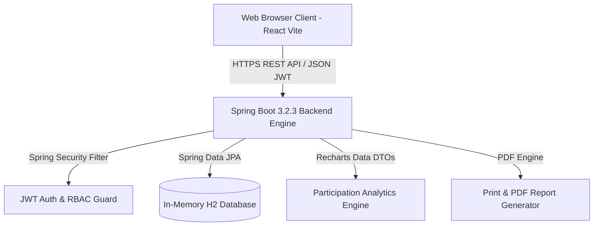
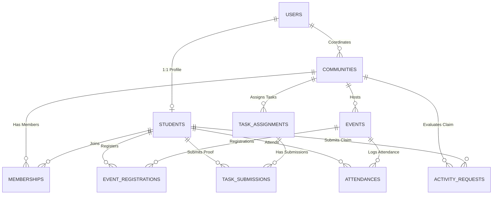

# 📄 Software Requirements Specification (SRS)
## Smart Campus Extracurricular & Community Tracking System (SCTS)

**Project Team:** RedStone Rebels  
**Team Leader:** Pavithra U  
**Team Members:** Prabhu A, Nithick S  
**Document Version:** 1.0.0  
**Date:** August 1, 2026  
**Status:** Approved & Verified  
**Standard:** IEEE 830-1998 Compatible SRS Format  

---

## 🏆 Team Credits

### 🚩 **Team Name:** RedStone Rebels

| Role | Name | Position |
| :--- | :--- | :--- |
| **👑 Team Leader** | **Pavithra U** | Project Lead & System Architecture |
| **👨‍💻 Team Member** | **Prabhu A** | Full-Stack Core Engineer |
| **👨‍💻 Team Member** | **Nithick S** | Backend & Database Systems |

---

## Table of Contents
1. [1. Introduction](#1-introduction)
   - 1.1 Purpose
   - 1.2 Scope
   - 1.3 Definitions, Acronyms, and Abbreviations
   - 1.4 References
   - 1.5 Overview
2. [2. Overall Description](#2-overall-description)
   - 2.1 Product Perspective
   - 2.2 Product Functions
   - 2.3 User Classes and Characteristics
   - 2.4 Operating Environment
   - 2.5 Design and Implementation Constraints
3. [3. External Interface Requirements](#3-external-interface-requirements)
   - 3.1 User Interfaces
   - 3.2 Software Interfaces
   - 3.3 Communication Interfaces
4. [4. System Features & Functional Requirements](#4-system-features--functional-requirements)
   - 4.1 Module 1: Authentication & Role-Based Access Control (RBAC)
   - 4.2 Module 2: Community & Membership Management
   - 4.3 Module 3: Task Taxonomy & Governance (`COMMUNITY_TASK` vs `DAILY_TASK`)
   - 4.4 Module 4: Event Scope & Participation Engine (`COMMUNITY_EVENT` vs `GLOBAL_EVENT`)
   - 4.5 Module 5: Achievement Claims & Activity Requests
   - 4.6 Module 6: Gamification Point Engine & Leaderboards
   - 4.7 Module 7: Live Participation Analytics & Data Visualizations
   - 4.8 Module 8: Notifications & Communication System
   - 4.9 Module 9: Portfolio & PDF Report Generator
5. [5. Non-Functional Requirements](#5-non-functional-requirements)
   - 5.1 Performance Requirements
   - 5.2 Security & Safety Requirements
   - 5.3 Reliability & Availability
   - 5.4 Usability & Design Aesthetics
6. [6. Data Model & Database Specification](#6-data-model--database-specification)

---

## 1. Introduction

### 1.1 Purpose
This Software Requirements Specification (SRS) document details the complete functional, non-functional, and architectural requirements for the **Smart Campus Extracurricular & Community Tracking System (SCTS)**, designed by **Team RedStone Rebels**.

### 1.2 Scope
SCTS is a multi-tenant university campus platform designed to centralize and automate student participation across 30+ extracurricular campus communities. The software implements:
- Role-based workflows for **Students**, **Community Coordinators**, and **Faculty Admins**.
- Task governance differentiating **Faculty Community Tasks** and **Coordinator Daily Tasks**.
- Event visibility enforcement restricting **Private Community Events** to approved members while opening **Global Campus Events** to all students.
- An automated **Gamification Point Engine** (+1 Event, +3 Daily Task, +5 Community Task, Custom Achievement Claims).
- Live interactive Recharts data visualization for deliverable verifications and participation rates.

---

## 2. Overall Description

### 2.1 Product Perspective

---

## 6. Data Model & Database Specification

